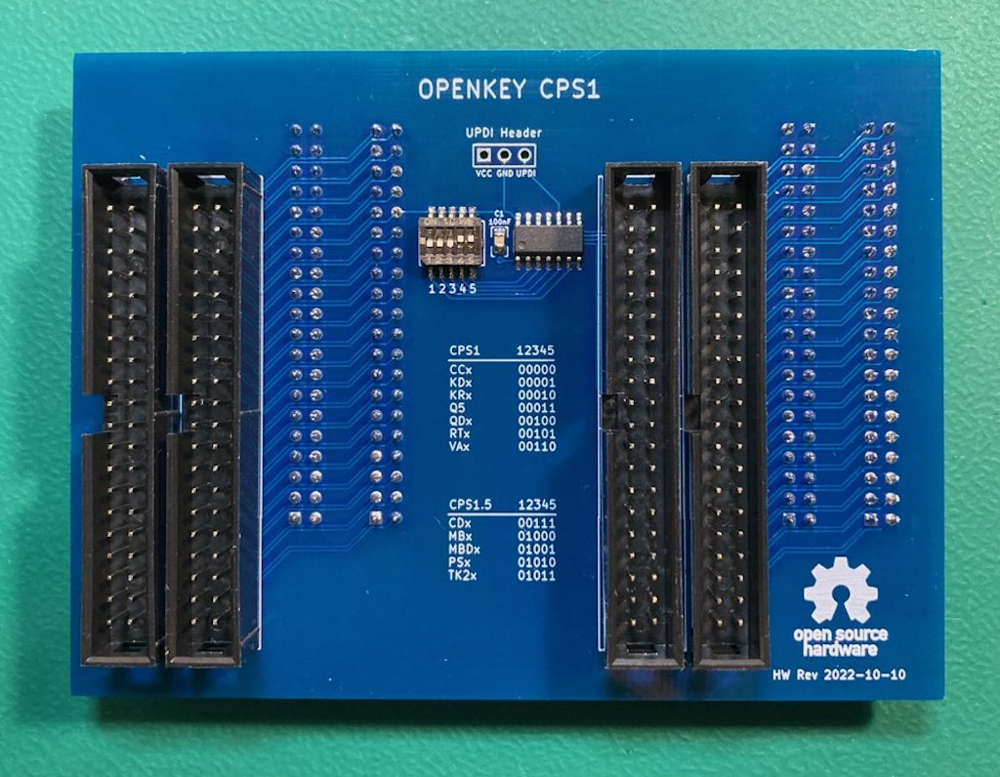
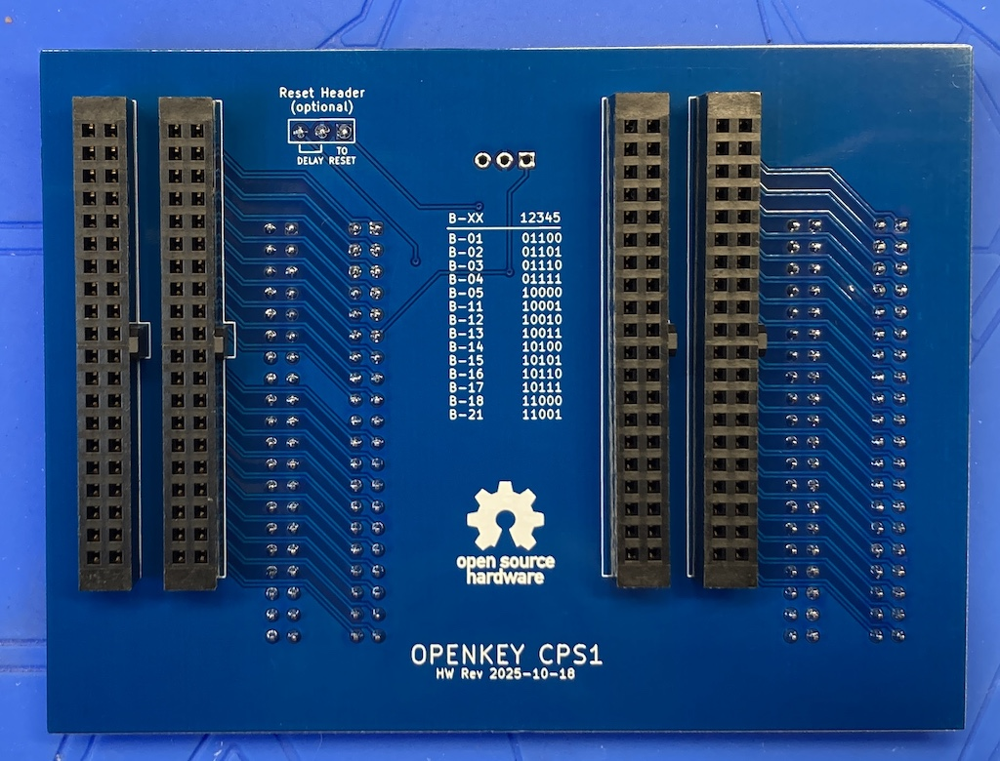
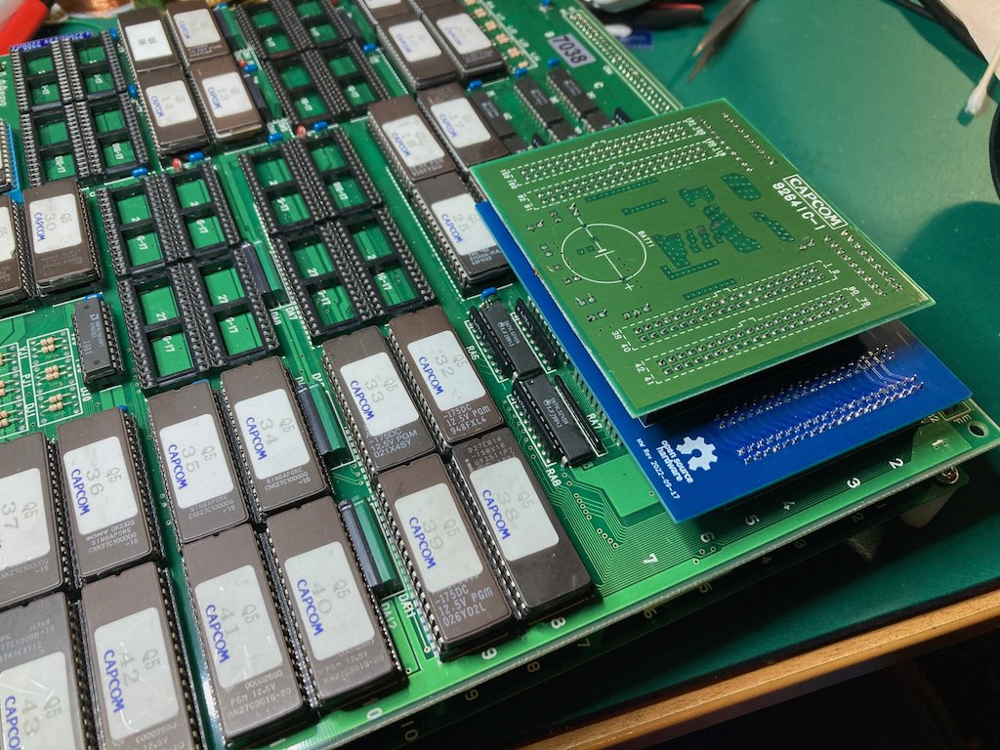
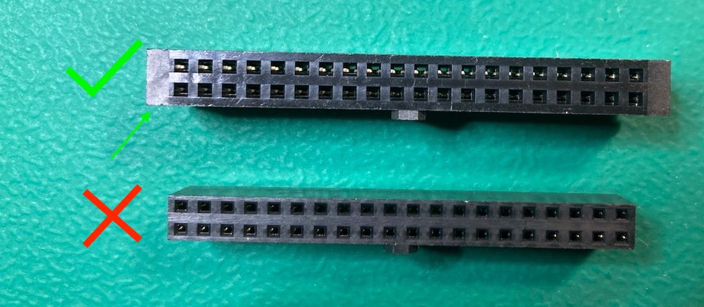
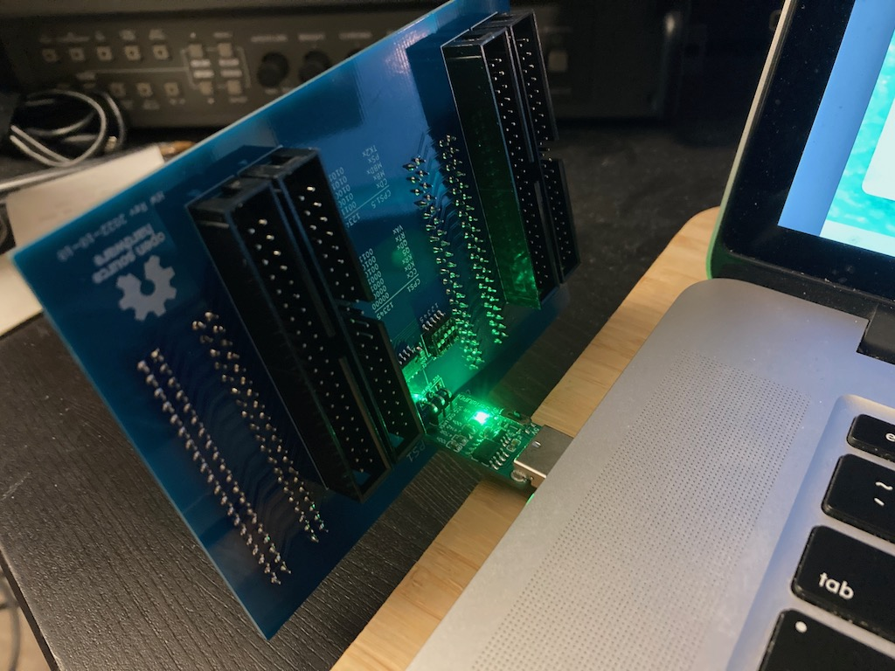
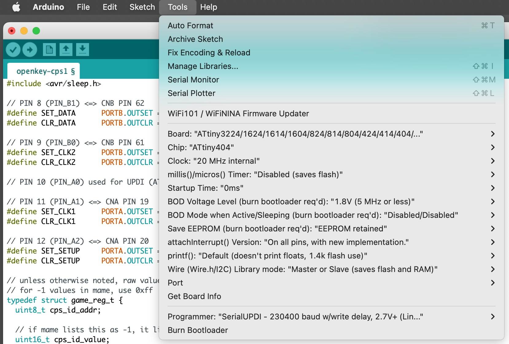
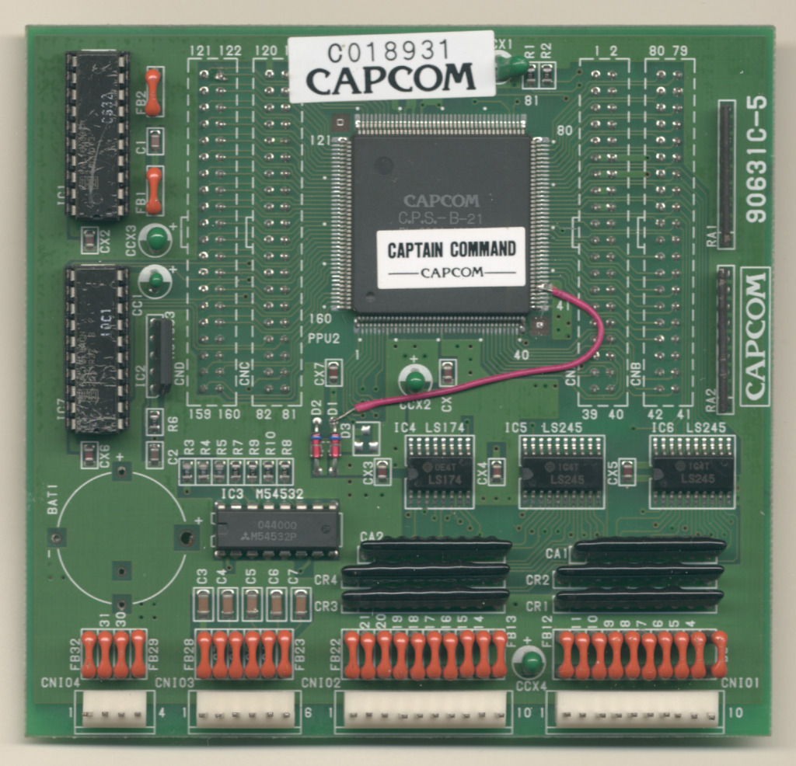
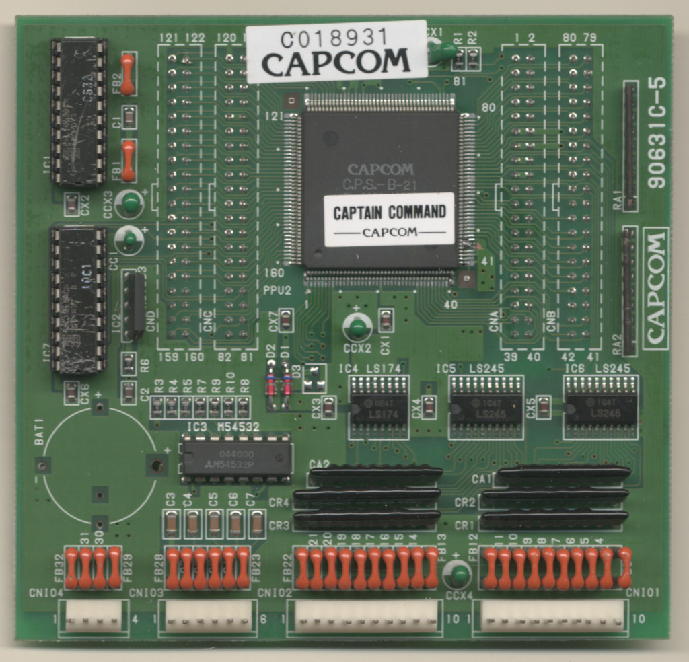
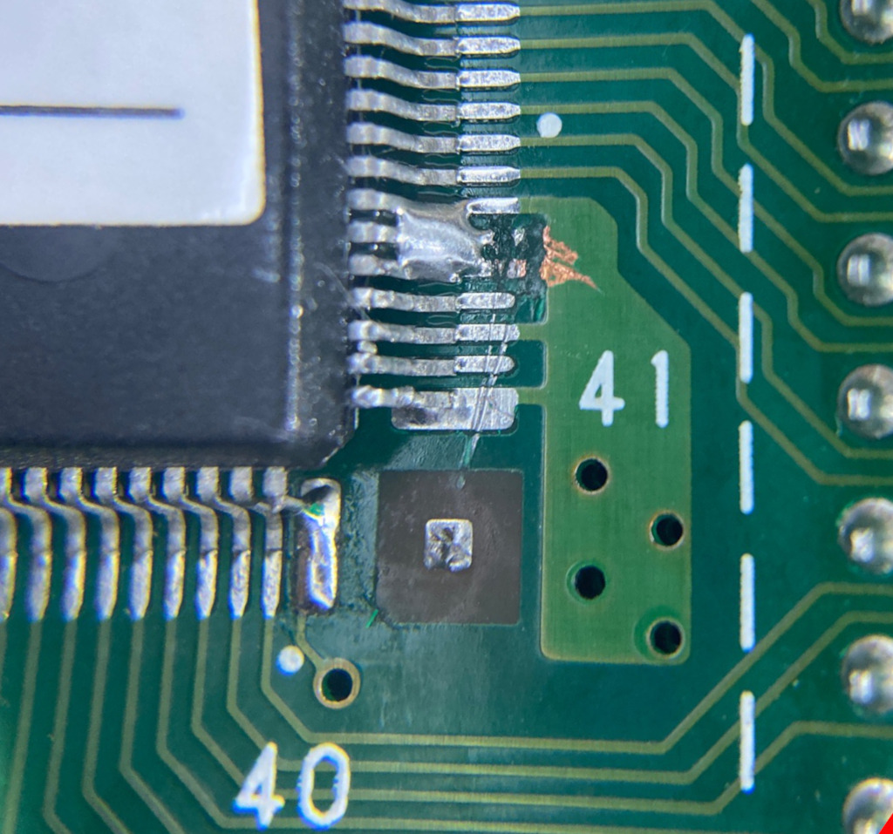

# openkey-cps1
---
* [Overview](#overview)
* [Supported C Boards](#supported-c-boards)
* [Supported Games / B-XX Chips](#supported-games--b-xx-chips)
  * [CPS 1](#cps1)
  * [CPS 1.5](#cps15)
  * [B-XX](#b-xx)
* [Hardware](#hardware)
  * [PCB Manufacturing](#pcb-manufacturing)
  * [BOM](#bom)
  * [Assembly](#assembly)
* [Programming](#programming)
  * [Hardware](#hardware-1)
  * [Software](#software)
* [CPS 1.5 Case](#cps-15-case)
* [Reverting a modified C Board](#reverting-a-modified-c-board)

## Overview
This is an opensource/hardware implementation of an on the fly CPS B-21 chip programmer that consists of a PCB that sits between CPS1/1.5 B and C boards.

 

Installed: 

This project is providing the same functionality as [Undamned's InfiniKey-CPS1](https://www.arcade-projects.com/threads/infinikey-cps1.8337/).  The lack of supply is what prompted me to make openkey-cps1.  If they ever end up coming back in stock please consider purchasing those to support [Undamned](https://www.arcade-projects.com/forums/temple-of-the-undamned.77/)'s work.

Details on *how* to program the B-21 chip configuration can be found in [Eduardo Cruz](http://arcadehacker.blogspot.com/)'s [write up](http://arcadehacker.blogspot.com/2015/04/capcom-cps1-part-1.html) and [youtube video](https://www.youtube.com/watch?v=IBZc__9sM28).

Details on *what* to program can be found in MAME's code for the [CPS1](https://github.com/mamedev/mame/blob/master/src/mame/capcom/cps1_v.cpp#L470).

## Supported C Boards
The following unmodified C Boards are supported

* [90630C-4](https://www.mvs-scans.com/index.php/CPS1_-_C_Board_90630C-4)
* [90631C-5](https://www.mvs-scans.com/index.php/CPS1_-_C_Board_90631C-5)
* [92641C-1](https://www.mvs-scans.com/index.php/CPS1_-_C_Board_92641C-1)

## Supported Games / B-XX Chips
---
openkey-cps1 supports either having a 5 position switch or using solder jumpers for picking what to program into the B-21 Chip.   Below is a list of supported configurations/games and what switches/jumpers must be used for each.

#### CPS1
| Switch 12345 | Program ROM Labels | Game Name | Tested / Working |
|:---------------:|:------------------:|-----------|:--------------:|
| 00000 | CCE CCJ CCU  | Captain Commando | YES |
| 00001 | KDE KDJ KDU | The King of Dragons | |
| 00010 | KR_23E KR_23J KR_23U | Knights of the Round | |
| 00011 | Q5 | Capcom World 2 | YES |
| 00100 | QDU | Quiz & Dragons | |
| 00101 | RTE RTJ RTU | Three Wonders | |
| 00110 | VAE VAJ VAU | Varth | |

#### CPS1.5
| Switch 12345 | Program ROM Labels | Game Name | Tested / Working |
|:---------------:|:------------------:|-----------|:--------------:|
| 00111 | CDE CDJ CDT CDU | Cadillacs & Dinosaurs | |
| 01000 | MBE MBJ MBU | Slam Masters / Muscle Bomber | |
| 01001 | MBDE MBDJ | Muscle Bomber Duo | |
| 01010 | PSE PSH PSJ PSU | Punisher | YES |
| 01011 | TK2E TK2J TK2U | Warriors of Fate | |

#### B-XX
In B-XX chips prior to B-21 the configurations were hard coded into the chip.  Its possible to program the B-21 to mimic these older chips.

| Switch 12345 |  B-XX  | Tested / Working |
|:---:|:------:|:---------------:|
| 01100 | B-01 | |
| 01101 | B-02 | |
| 01110 | B-03 | |
| 01111 | B-04 | |
| 10000 | B-05 | |
| 10001 | B-11 | |
| 10010 | B-12 | |
| 10011 | B-13 | |
| 10100 | B-14 | |
| 10101 | B-15 | |
| 10110 | B-16 | |
| 10111 | B-17 | |
| 11000 | B-18 | |
| 11001 | B-21 | |

## Hardware
---
#### PCB Manufacturing
There are no special requirements for manufacturing.

I've been using [jlcpcb](https://jlcpcb.com/) for PCB manufacturing.  Just watch out that by default they will add an order number to the silk screen unless you tell them not to.

#### BOM
| Quantity | Description | Part Number | DigiKey | Mouser | Notes |
|:----------:|-------------|-------------|---------|--------|-------|
| 1 | ATtiny404 20Mhz | ATTINY404-SSN | [ATTINY404-SSN-ND](https://www.digikey.com/en/products/detail/microchip-technology/ATTINY404-SSN/9947546) | [556-ATTINY404-SSNR](https://www.mouser.com/ProductDetail/Microchip-Technology-Atmel/ATTINY404-SSNR?qs=F5EMLAvA7IAEqD7Aw0z%252B9Q%3D%3D) | Other ATtiny tinyAVR 0/1/2-series models should be viable as well.  The code compiles to just under 1.5K in size, so any that have 2k or more of flash should work.  Just note I have only tested with 404s |
| 1 | 100nf / 0.1uf SMD Ceramic Capacitor 0805 Size | | | | |
| 1 | 5 Position Slide Switch | Würth Elektronik 416131160805 | [732-3855-2-ND](https://www.digikey.com/en/products/detail/w%C3%BCrth-elektronik/416131160805/3174531) | [710-416131160805](https://www.mouser.com/ProductDetail/Wurth-Elektronik/416131160805?qs=2kOmHSv6VfT1rqUsojuQog%3D%3D) | **Optional** not needed if using the solder jumpers to pick the game.
| 4 | 2x20 Pin Male IDC connector | SBH11-PBPC-D20-ST-BK | [S9175-ND](https://www.digikey.com/en/products/detail/sullins-connector-solutions/SBH11-PBPC-D20-ST-BK/1990068) | ?? | This is just a standard IDE male connector |
| 4 | 2x20 Pin Female socket | SFH11-PBPC-D20-ST-BK | [S9200-ND](https://www.digikey.com/en/products/detail/sullins-connector-solutions/SFH11-PBPC-D20-ST-BK/1990093) | ?? |  |

**IMPORTANT** For the 2x20 Pin Female socket, if you choose a different part, make sure you get ones that have the extra plastic on the edge as seen below.

The extra plastic prevents the connector from being inserted off-by-one.  An off-by-one insertion will cause a direct short to ground. This can cause catastrophic damage to your Game PCB if your power supply doesn't have short circuit protection.

Don't be fooled into thinking you don't need the extra plastic because you see the key. The bottom connector for example is too skinny for the key to actually prevent off-by-one insertion.  Ask me how I know ;)

#### Assembly
Nothing special required here.  Personally I do SMD first, the the 40p connectors.

## Programming
---
#### Hardware
Programming is done with a UPDI programmer.  I've been using this one:

[Serial UPDI Programmer for ATmega 0-Series, or ATtiny 0-Series or 1-Series, or AVR DA or AVR DB](https://www.amazon.com/dp/B09X64YRLD?psc=1&ref=ppx_yo2ov_dt_b_product_details)

The openkey-cps1 programming port is setup so you can wedge the pins from the above programmer directly into them to programming.

Of course be sure you properly orient the board so the labeled pin/holes match up.  vcc to vcc, gnd to gnd, and updi to updi.

#### Software
For software I've been using the [Arduino IDE](https://www.arduino.cc/en/software/OldSoftwareReleases) with [megaTinyCore](https://github.com/SpenceKonde/megaTinyCore), which adds support for tinyAVR 0/1/2-Series MCUs.

**NOTE**: The makers of megaTinyCore currently recommend using Arduino IDE version 1.8.13 for best compatibility.  2.0 definitely does not work!

To install the megaTinyCore you, should just need to add http://drazzy.com/package_drazzy.com_index.json to "Additional Boards Manager URLs" in the settings for the Arduino IDE.

From there you need to configure the board/programming settings.  I've been using these:

## CPS 1.5 Case
I only have 1 cps 1.5 game (punisher), so my ability to test openkey-cps1 fitting inside the case is limited.  Its a tight fit height wise in my case, to the point where the pins that stick out of the C board are right at the point of touching the top of the case.  Be sure all boards in the stack are fully seated and don't force the top cover on if its not fitting.

## Reverting a modified C Board
Its pretty common to find one of the required C boards as having been modified to disable using the programmable configuration.  This forces them to use their default configuration.

The tale tale sign of a modified C board are pins 45 and 46 will have cut traces (normally they go to ground) and a wire from them to some point on the C board that is supplying 5 volts.  For example

The way I normally revert them is to remove the wire, and then put a solder blob so that pins 45, 46, and 47 (ground) are bridged together.  This puts the board back in its original state with all 3 of those pins being tied to ground.

Here is a close up of the solder blob on the pins

You can also see where they had cut the traces for pins 45 and 46, which would normally connect to that ground plane to the right.
