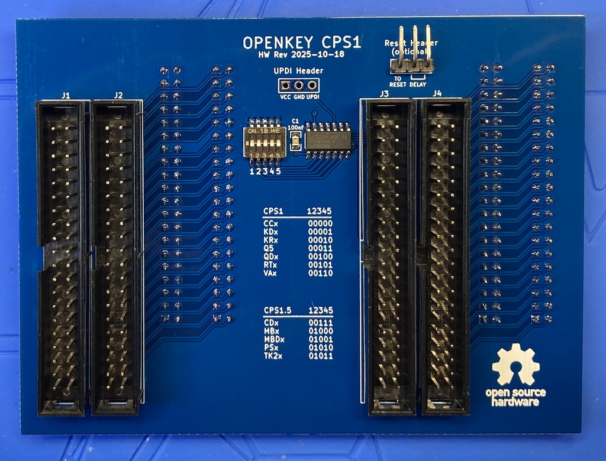
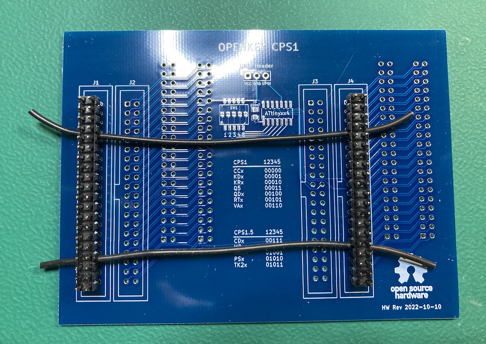
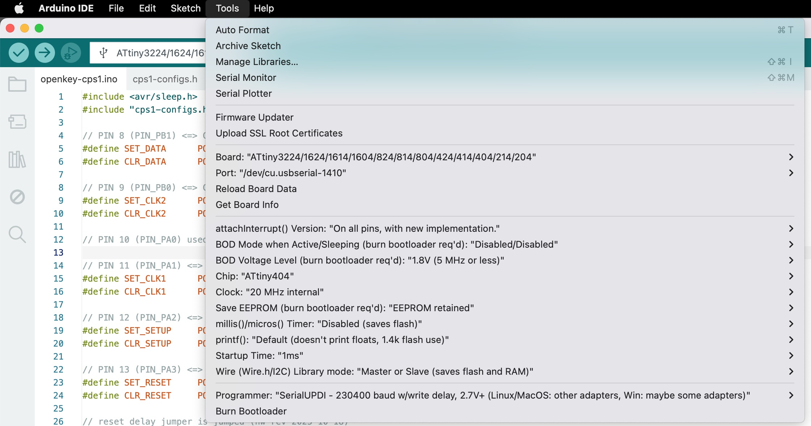
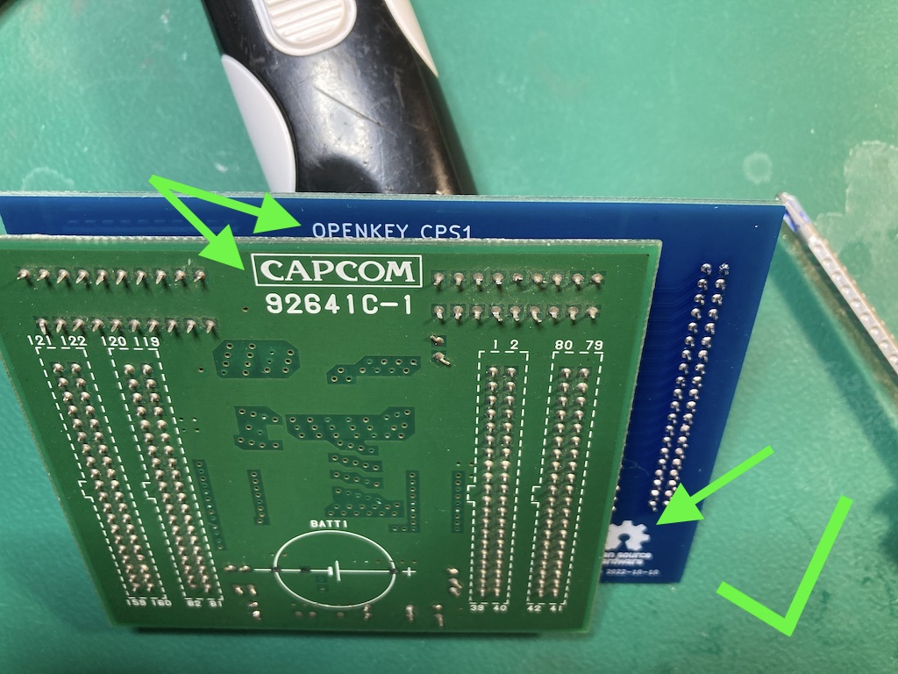

# openkey-cps1
---
* [Overview](#overview)
* [Project Status](#project-status)
* [Supported C Boards](#supported-c-boards)
* [CPS 1 Case](#cps-1-case)
* [Supported Games / B-XX Chips](#supported-games--b-xx-chips)
  * [CPS 1](#cps-1)
  * [CPS 1.5](#cps-15)
  * [B-XX](#b-xx)
* [Hardware](#hardware)
  * [PCB Manufacturing](#pcb-manufacturing)
  * [BOM](#bom)
  * [Assembly](#assembly)
      * [CPS 1](#cps-1-1)
      * [CPS 1.5](#cps-15-1)
* [Programming](#programming)
  * [Hardware](#hardware-1)
  * [Software](#software)
* [Installation](#installation)
  * [CPS 1](#cps-1-2)
  * [CPS 1.5](#cps-15-2)
* [Reverting a modified C Board](#reverting-a-modified-c-board)

## Overview
This is an opensource/hardware implementation of an on the fly CPS B-21 chip programmer that consists of a PCB that sits between CPS1/1.5 B and C boards.

 

Installed: 

This project is providing the same functionality as [Undamned's InfiniKey-CPS1](https://www.arcade-projects.com/threads/infinikey-cps1.8337/).  The lack of supply is what prompted me to make openkey-cps1.  If they ever end up coming back in stock please consider purchasing those to support [Undamned](https://www.arcade-projects.com/forums/temple-of-the-undamned.77/)'s work.

Details on *how* to program the CPS B-21 chip configuration can be found in [Eduardo Cruz](http://arcadehacker.blogspot.com/)'s [write up](http://arcadehacker.blogspot.com/2015/04/capcom-cps1-part-1.html) and [youtube video](https://www.youtube.com/watch?v=IBZc__9sM28).  Additional information is also comes from [cps2-reverse](https://gitlab.com/loic.petit/cps2-reverse) project which has details on the [CPS B-21](https://gitlab.com/loic.petit/cps2-reverse/-/tree/master/DLs/DL-0921) chip.

Details on *what* to program can be found in MAME's code for the [CPS1](https://github.com/mamedev/mame/blob/master/src/mame/capcom/cps1_v.cpp#L470).

## Project Status
**PCB:** I would consider the design PCB done at this point.  I'm open to any input on changes/improvements as this is only my 2nd PCB design.

**Firmware:** Need to get untested games tested

**Documentation:** Mostly done

## Supported C Boards
The following unmodified C Boards are supported

* [90630C-4](https://www.mvs-scans.com/index.php/CPS1_-_C_Board_90630C-4)
* [90631C-5](https://www.mvs-scans.com/index.php/CPS1_-_C_Board_90631C-5)
* [92641C-1](https://www.mvs-scans.com/index.php/CPS1_-_C_Board_92641C-1)

## CPS 1 Case
openkey-cps1 will not fit in the CPS 1 case.  As far as I know only Varith and Capcom World 2 came in a case.  You can still use openkey-cps1 to desuicide the C board.  Replace the battery then boot up the game with openkey-cps1 installed.  Verify it runs as expected, then power off, remove openkey-cps1 and reinstall the board in the case.

## Supported Games / B-XX Chips
openkey-cps1 supports either having a 5 position switch or using solder jumpers for picking what to program into the B-21 Chip.  For the switch, ensure the switches are fully set.  You should hear a click sound as you change the position.

 Below is a list of supported configurations/games and what switches/jumpers must be used for each.

#### CPS 1
| Switch 12345 | Program ROM Labels | Game Name | Tested / Working |
|:---------------:|:------------------:|-----------|:--------------:|
| 00000 | CCE CCJ CCU  | Captain Commando | YES |
| 00001 | KDE KDJ KDU | The King of Dragons | |
| 00010 | KR_23E KR_23J KR_23U | Knights of the Round | |
| 00011 | Q5 | Capcom World 2 | YES |
| 00100 | QDU | Quiz & Dragons | YES |
| 00101 | RTE RTJ RTU | Three Wonders | YES |
| 00110 | VAE VAJ VAU | Varth | |

#### CPS 1.5
| Switch 12345 | Program ROM Labels | Game Name | Tested / Working |
|:---------------:|:------------------:|-----------|:--------------:|
| 00111 | CDE CDJ CDT CDU | Cadillacs & Dinosaurs | |
| 01000 | MBE MBJ MBU | Slam Masters / Muscle Bomber | YES |
| 01001 | MBDE MBDJ | Muscle Bomber Duo | |
| 01010 | PSE PSH PSJ PSU | Punisher | YES |
| 01011 | TK2E TK2J TK2U | Warriors of Fate | |

#### B-XX
For B-XX chips prior to B-21 the configurations were hard coded into the chip.  Its possible to program the B-21 to mimic these older chips.

Some older B-XX boards will have the number stamped on instead of etched into the chip.  These stamped numbers maybe incorrect.  For example I have a final fight board that has 04 stamped on as the XX number.  Picking B-04 on openkey-cps1 didn't work.  After dumping the program roms I was able to determine it was the ffightua romset.   [Mame](https://github.com/mamedev/mame/blob/master/src/mame/capcom/cps1_v.cpp#L1754) shows this romset actually uses B-01.  Switching to B-01 made the game work.

| Switch 12345 |  B-XX  | Tested / Working |
|:---:|:------:|:---------------:|
| 01100 | B-01 | YES |
| 01101 | B-02 | |
| 01110 | B-03 | |
| 01111 | B-04 | |
| 10000 | B-05 | |
| 10001 | B-11 | YES |
| 10010 | B-12 | YES |
| 10011 | B-13 | YES |
| 10100 | B-14 | YES |
| 10101 | B-15 | |
| 10110 | B-16 | YES |
| 10111 | B-17 | YES |
| 11000 | B-18 | |
| 11001 | B-21 | YES |

## Hardware
#### PCB Manufacturing
There are no special requirements for manufacturing.

I've been using [jlcpcb](https://jlcpcb.com/) for PCB manufacturing.  Just watch out that by default they will add an order number to the silk screen unless you tell them not to.

#### BOM
| Quantity | Description | Part Number | DigiKey | Mouser | Notes |
|:----------:|-------------|-------------|---------|--------|-------|
| 1 | ATtiny404 20Mhz | ATTINY404-SSN | [ATTINY404-SSN-ND](https://www.digikey.com/en/products/detail/microchip-technology/ATTINY404-SSN/9947546) | [556-ATTINY404-SSNR](https://www.mouser.com/ProductDetail/Microchip-Technology-Atmel/ATTINY404-SSNR?qs=F5EMLAvA7IAEqD7Aw0z%252B9Q%3D%3D) | Other ATtiny tinyAVR 0/1/2-series models should be viable as well.  The code compiles to just under 1.5K in size, so any that have 2k or more of flash should work.  Just note I have only tested with 404s |
| 1 | 100nf / 0.1uf SMD Ceramic Capacitor 0805 Size | | | | |
| 1 | 5 Position Slide Switch | Würth Elektronik 416131160805 | [732-3855-2-ND](https://www.digikey.com/en/products/detail/w%C3%BCrth-elektronik/416131160805/3174531) | [710-416131160805](https://www.mouser.com/ProductDetail/Wurth-Elektronik/416131160805?qs=2kOmHSv6VfT1rqUsojuQog%3D%3D) | **Optional** not needed if using the solder jumpers to pick the game.
| 4 | CPS1: 2x20 Pin Male IDC connector CPS1.5: 2x20pin Male Header (no shroud) | SBH11-PBPC-D20-ST-BK N/A | [S9175-ND](https://www.digikey.com/en/products/detail/sullins-connector-solutions/SBH11-PBPC-D20-ST-BK/1990068) [2x20 Pin Header](https://www.amazon.com/dp/B083DYVWDN?psc=1&ref=ppx_yo2ov_dt_b_product_details) | ?? | This is just a standard IDE male connector This is just a normal 2x20 Pin header you might find for a PI's GPIO pins |
| 4 | 2x20 Pin Female socket | SFH11-PBPC-D20-ST-BK | [S9200-ND](https://www.digikey.com/en/products/detail/sullins-connector-solutions/SFH11-PBPC-D20-ST-BK/1990093) | ?? |  |

**IMPORTANT** For the 2x20 Pin Female socket, if you choose a different part, make sure you get ones that have the extra plastic on the edge as seen below.

The extra plastic prevents the connector from being inserted off-by-one.  An off-by-one insertion will cause a direct short to ground. This can cause catastrophic damage to your Game PCB if your power supply doesn't have short circuit protection.

Don't be fooled into thinking you don't need the extra plastic because you see the key. The bottom connector for example is too skinny for the key to actually prevent off-by-one insertion.  Ask me how I know ;)

#### Assembly
##### CPS 1
Nothing special is needed when assembling a openkey-cps1 that will be used in a normal non-case'd CPS1 board.  Install SMD components first, then install the 40 pin male/female connectors.

##### CPS 1.5
Installing openkey-cps1 in a CPS 1.5 case is a tight fit height wise.  The pins that stick out of the C board are at the point of touching the top of the case.  If you are ok with this just use the 40 pin IDE style connectors.  Otherwise you can do the following.

To deal with this the best course of action is to only have raw pins for the male 40 pin connectors instead of ones with the plastic shroud.  This will allow the C board to sit flush with the openkey-cps1 board and reduce the height enough to not touch the top of the case.  Below is what has worked well for me, but there maybe better ways.

Some things to consider:
  * The normal pin length of a male pin is 6mm
  * The max pin height above the openkey-cps1 board should **not exceed 7mm**.  Any longer and the pin will bottom out on the female connector on the C Board.  This will cause the C board to not sit flush to the openkey-cps1 board and defeat the purpose of using raw pins.
  * You can't just install the normal 40pin IDE style connector then remove the shroud.  The resulting pin length ends up being 8mm.
  * You can't just install a normal 40 pin header and remove the plastic.  The resulting pin length ends up being 8mm.
  * The total length of metal pin on most headers is going to be 11.5mm
  * PCB thickness should be 1.6mm, which leave about 10mm worth of metal pin length we must deal with.

This method targets having 7mm above and 3mm below the openkey-cps1 board.  I've tried 6mm/4mm, but that 4mm is long enough there is risk it could hit/damage components on the B board.

You will want 4 normal 2x20 pin headers where the total metal length is 11.5mm.  Additionally you will want something you can use as a 1.5mm spacer.  I'm using the 2 black 24AWG wires in the picture below.

You will want to install 2 of the 2x20 pin header upside into board.  I would advise doing the 2 outer ones first. Put the 1.5mm spacer between the board and the plastic part of the connector as seen below.

Now flip the board over to the side we will be soldering.  It should look something like this.  

The length of the pins should be 3mm, which will mean 7mm on the top.

At this point I would tack 2 pins on each connector then verify spacing of the connectors looks good.  It should look something like this (with the spacer wires removed)

If you measure the pin lengths they should be right at 7mm.

Fully solder those 2 connectors.  Its extra importing you check your soldering that this point.  The next steps will involve removing the plastic part of the connectors which will make every pin independent and a pita to solder.

To protect the board I would put down some painters tape.  Additionally I use this [chip lifter](https://www.amazon.com/Wiha-27921-PicoFinish-Precision-Chiplifter/dp/B0875LSTD3/ref=sr_1_5)  as my pry tool. The grove makes it possible to get in between the pins to when prying up the plastic.

If you have a hot air station you can use it to heat (200C) up the plastic to make it easier to get off.  You will want to do the removable in a couple passes with your pry tool, lifting up the plastic a few mm per pass.

As you get the plastic higher up on the pins it can be helpful to add a spacer under you pry tool.  I'm just using a old prototype board.

Once you get both plastics off it should looks like this

Then you can go onto the middle 2 connectors.  You can bypass using the 1.5mm spacer on these.  Instead just put the connects in the PCB upside down as before, then flip PCB over as if you were going to solder them.  The already soldered connectors will hold the PCB 7mm off your table, which will mean your to be installed connectors will also be 7mm off your table.  Tack, verify and then fully solder.

Repeat the process to remove the plastic

When you are all done you should have this

Now do a test fit of the C board and it should be flush with the openkey-cps1 PCB

Install the SMD components and female 40 pin connectors.  This one was going on my Punisher board, so I just used the solder jumpers instead of installing the 5 position switch.

## Programming
#### Hardware
Programming is done with a UPDI programmer.  I've been using this one:

[Serial UPDI Programmer for ATmega 0-Series, or ATtiny 0-Series or 1-Series, or AVR DA or AVR DB](https://www.amazon.com/dp/B09X64YRLD?psc=1&ref=ppx_yo2ov_dt_b_product_details)

Note: This programmer (and likely others) has a switch for 3.3V and 5V.  Set it to 5V.

The openkey-cps1 programming port is setup so you can wedge the pins from the above programmer directly into them to programming.

Of course be sure you properly orient the board so the labeled pin/holes match up.  vcc to vcc, gnd to gnd, and updi to updi.

#### Software
For software I've been using the [Arduino IDE](https://www.arduino.cc/en/software/OldSoftwareReleases) with [megaTinyCore](https://github.com/SpenceKonde/megaTinyCore), which adds support for tinyAVR 0/1/2-Series MCUs.

**NOTE**: The makers of megaTinyCore currently recommend using Arduino IDE version 1.8.13 for best compatibility.  2.0 definitely does not work!

To install the megaTinyCore you, should just need to add http://drazzy.com/package_drazzy.com_index.json to "Additional Boards Manager URLs" in the settings for the Arduino IDE.

From there you need to configure the board/programming settings.  I've been using these:

## Installation
#### CPS 1
Nothing really special here.  Use the dip switches or solder jumpers to pick your game/chip and put the openkey-cps1 board between your C and B boards.  The male/female connectors should prevent you from installing incorrectly.

#### CPS 1.5
This is assuming you are using an openkey-cps1 board with the raw pin headers on top.  There is nothing preventing you from install the C board incorrectly.

Use the dip switches or solder jumpers to pick your game.

Verify you have the C board oriented the correct way as seen below.

The C board female connector will prevent you from installing it to high or low, but it will not prevent installation to the left or the right by one.

Check both sides of the female C board connector to verify you dont see any of the pins.

other side

If its off by one of the sides will look like this

## Reverting a modified C Board
Its pretty common to find one of the required C boards as having been modified to disable using the programmable configuration.  This forces them to use their default configuration.

The tale tale sign of a modified C board are pins 45 and 46 will have cut traces (normally they go to ground) and a wire from them to some point on the C board that is supplying 5 volts.  For example

The way I normally revert them is to remove the wire, and then put a solder blob so that pins 45, 46, and 47 (ground) are bridged together.  This puts the board back in its original state with all 3 of those pins being tied to ground.

Here is a close up of the solder blob on the pins

You can also see where they had cut the traces for pins 45 and 46, which would normally connect to that ground plane to the right.
