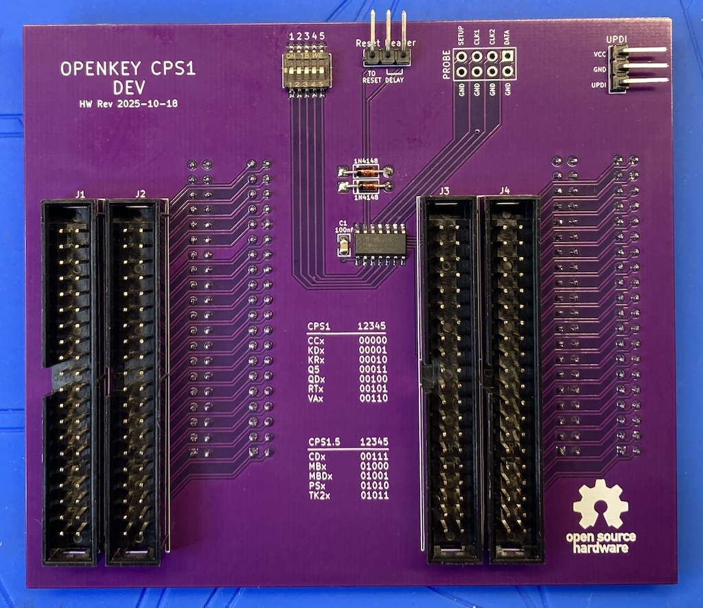
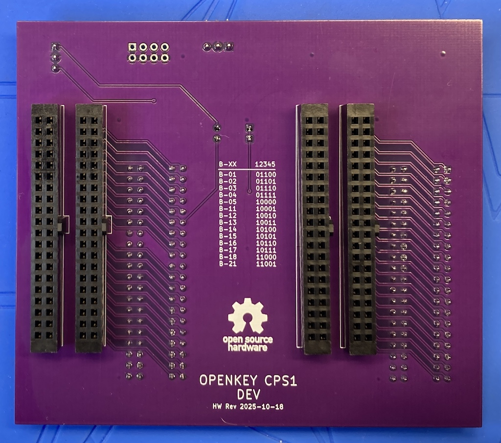

# openkey-cps1-dev Hardware
This is a dev version of openkey-cps1 hardware that makes it possible to rapidly test firmware changes.  I'm mainly just including this in the repo so I don't use it.

**Top:**

**Bottom:**

As you can see its a bit taller then the non-dev version to allow being able to change the selected game and re-program the firmware while the board is plugged into a cps1 A-B-C stack.  The 2 diodes ensure that USB power can only goto the ATtiny and that cps1 board power doesn't goto the USB.

After programming the ATtiny you will want to disconnect it from USB and either power-on or powercycle the cps1 board.  This is to ensure power is fully removed from the ATtiny so it will boot up normally when cps1 power is applied.